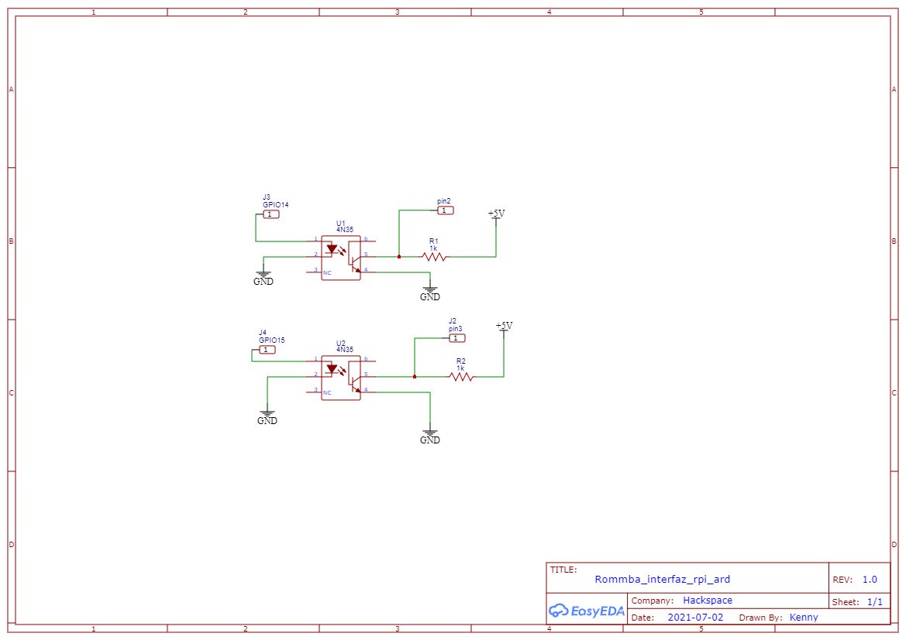

# Code and schematics for roomba bot

## Hardware

Use two 4n35 ICs with resistors of 10K each.

Note:  at the RPI conector, be careful with jumping ground. Cause could be a drain and the camera wont work.



## Software

### [Updates]

Software change a little at arduino file. 

Adding three functions 

    Near to the host (with HC-06)
    Interrupts pin 2 and pin 3
    Emergency stop

Note: if you decided to change the controller, could be a problem with frecuency rate with the drivers and logoc level.

On behave of rpi code was integraded the part whom manage BLE server with tracking code.

### Hardware use (and suports)

    -Arduino (uno, nano, due, mega)
    -Raspberry pi 3 B+
    -Raspberry camera V1.0
    -Drivers for motor brushless with Hall sensors of 350W 

### Config of RPI

    - Install opencv3
        - 
    - Enable BLE
        - 
        ```sudo nano /etc/systemd/system/dbus-org.bluez.service
            ExecStart=/usr/lib/bluetooth/bluetoothd -E
            sudo reboot now
            ```