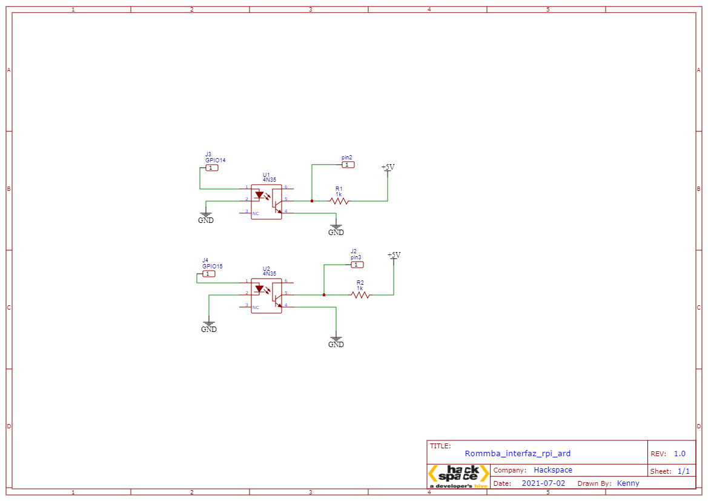
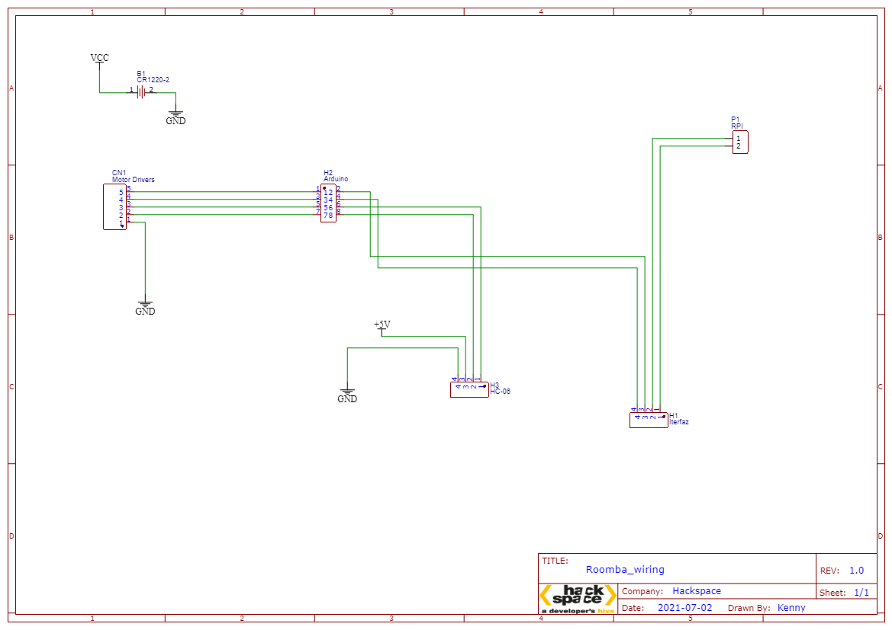

# Code and schematics for roomba bot

## Hardware

Use two 4n35 ICs with resistors of 10K each.

Note:  at the RPI conector, be careful with jumping ground. Cause could be a drain and the camera wont work.



## Software

### [Updates]

Software change a little at arduino file. 

Adding three functions 

    Near to the host (with HC-06)
    Interrupts pin 2 and pin 3
    Emergency stop

Note: if you decided to change the controller, could be a problem with frecuency rate with the drivers and logic level.

On behave of rpi code was integraded the part whom manage BLE server with tracking code.

### Hardware use (and suports)

    -Arduino (uno, nano, due, mega)
    -Raspberry pi 3 B+
    -Raspberry camera V1.0
    -Drivers for motor brushless with Hall sensors of 350W 

### Config of RPI

- Install opencv3
https://www.pyimagesearch.com/2017/09/04/raspbian-stretch-install-opencv-3-python-on-your-raspberry-pi/ 
- Enable BLE

```
    sudo nano /etc/systemd/system/dbus-org.bluez.service
    ExecStart=/usr/lib/bluetooth/bluetoothd -E
    sudo reboot now
```

## Wiring of robot (General)



    Notes: 
        -RPI is Isolated from others boards and drivers
        -RPI has a independent batery
        -RPI just connect to interfaz and Picamera
        -Arduino/drivers/HC-06 share ground
        -Arduino/HC-06 share batery
        -Drivers and motors share batery
        -Careful batery levels are diferent between them

    RPI(BDM)
    Pin 14 Left
    Pin 15 Right
    pin 18 (Enable Video Call)
        - "on" start tracking mov
        - "off" End tracking mov
    pin 17 (Enable 3d model)
        - "on" start mov for 3d model
        - "off" End mov for 3d model

    Arduino
    Int (2"left",3"right")

    pin 4   => (Enable follow tracking)
    pin 13  => (Enable 3d model)

    Drivers
    dirI 9
    dirD 6
    MotI 10
    MotD 5

    trig 7
    echo 8


    RPI => Interface => Ard

    2 ------ 14 (left)
    3 ------ 15 (right)
    4 ------ 18 (Follow)
    13------ 17 (3d)
